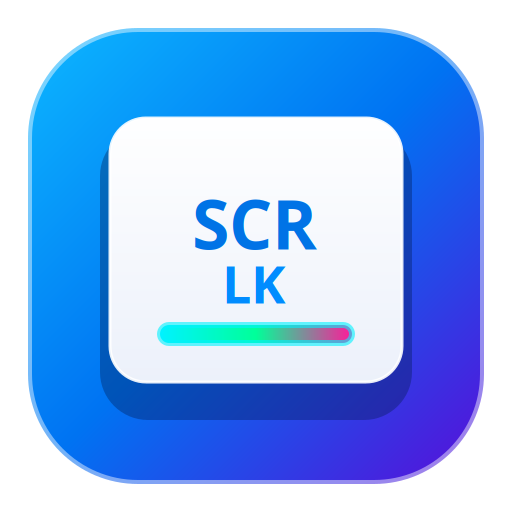

# ⌨️ MultKeyboard v1.0
### Gerenciador Definitivo de Iluminação RGB & Tecla Scroll Lock para Linux

<p align="center">
  
</p>

<p align="center">
  
  
  
  
  
  
</p>

---

## 💡 O Problema que este Projeto Resolve

Mais de **90% dos teclados gamers e multimídia de entrada e intermediários** (*Multilaser, Redragon, C3Tech, Knup, Fortrek, T-Dagger, Warrior, etc.*) utilizam o circuito eletrônico do **Scroll Lock** para alimentar a malha de iluminação LED RGB.

* No **Windows**, apertar `Scroll Lock` sempre ligou os LEDs imediatamente.
* No **Linux moderno (Ubuntu 20.04+, 22.04+, 24.04+, 26.04+ e outras distros)**, a transição do X11 para o **Wayland** desativou os comandos antigos como `xset led 3` por motivos de segurança e isolamento.
* Além disso, os compositores modernos (*GNOME Mutter, KDE KWin, Sway, Hyprland*) ignoram o Scroll Lock, e os nós de hardware em `/sys/class/leds/input*::scrolllock` mudam de número a cada reinicialização ou reconexão USB.

**O MultKeyboard resolve esse problema na raiz:**
Ele opera através de um serviço nativo (`scrolllock.service`) em segundo plano que monitora o barramento de eventos do kernel (`evdev`), descobre dinamicamente os teclados conectados via USB (suporte a *Hotplug*) e controla o hardware diretamente nos nós `sysfs`, funcionando **em qualquer ambiente de desktop, seja Wayland ou X11**.

---

## 🌐 Compatibilidade entre Distribuições Linux

O MultKeyboard foi construído sobre o ecossistema padrão do Linux (**Python 3** nativo, **systemd** e **GTK 3**). Ele é compatível com:

| Distribuição | Versões Suportadas | Servidor Gráfico | Status |
| :--- | :--- | :--- | :---: |
| **Ubuntu** | **18.04, 20.04, 22.04, 24.04, 26.04+** | Wayland / X11 | ✅ 100% Nativo |
| **Debian** | **10 (Buster), 11 (Bullseye), 12 (Bookworm), 13+** | Wayland / X11 | ✅ 100% Compatível |
| **Linux Mint** | **20, 21, 22+ (todas as edições)** | X11 / Wayland | ✅ 100% Compatível |
| **Pop!_OS / Zorin OS**| **Todas as versões ativas** | Wayland / X11 | ✅ 100% Compatível |
| **Fedora** | **35 até 42+** | Wayland / X11 | ✅ 100% Compatível |
| **Arch Linux / Manjaro** | **Rolling Release (Kernel atualizado)** | Wayland / X11 | ✅ 100% Compatível |
| **openSUSE** | **Tumbleweed & Leap 15.4+** | Wayland / X11 | ✅ 100% Compatível |

> **Nota:** Não requer compilação pesada nem bibliotecas de terceiros; utiliza exclusivamente o Python 3 nativo presente na instalação padrão de praticamente todas as distros Linux modernas.

---

## 🚀 Como Instalar

### Método 1: Linha de Comando One-Liner (Terminal)
Abra o terminal e cole o comando abaixo:
```bash
curl -fsSL https://raw.githubusercontent.com/rickchantres/MultKeyboard/main/install.sh | bash
```

---

### Método 2: Instalador de Dois Cliques (Download em Release)
Para quem prefere uma instalação gráfica visual com apenas 2 cliques:

1. Acesse a aba **[Releases](https://github.com/rickchantres/MultKeyboard/releases/latest)** deste repositório.
2. Baixe o executável standalone **`MultKeyboard-Instalador`** (~116 KB).
3. Dê dois cliques no arquivo (ou execute `./MultKeyboard-Instalador` no terminal).
4. O instalador exibirá uma janela com design estilo Apple macOS. Clique em **Instalar** e digite a sua senha quando solicitado.

*Se preferir baixar via terminal:*
```bash
wget -O MultKeyboard-Instalador https://github.com/rickchantres/MultKeyboard/releases/latest/download/MultKeyboard-Instalador
chmod +x MultKeyboard-Instalador
./MultKeyboard-Instalador
```

---

### Método 3: Clone do Repositório
```bash
git clone https://github.com/rickchantres/MultKeyboard.git
cd MultKeyboard
chmod +x install.sh
./install.sh
```

---

## 🎮 Teclas de Atalho Globais

O MultKeyboard roda como um serviço leve de sistema e permite controle total diretamente pelo teclado a qualquer momento:

| Atalho | Ação |
| :--- | :--- |
| **`[Scroll Lock]` + `[Espaço]`** *(ou `[F12]`)* | **Abre ou Minimiza** a interface gráfica no centro da tela. |
| **`[Scroll Lock]` + `[+]`** | Liga o modo pisca e **acelera** o ritmo (até 30ms). |
| **`[Scroll Lock]` + `[-]`** | **Desacelera** o ritmo das piscadas. No limite mínimo, **apaga** a luz. |
| **`[Scroll Lock]`** *(toque simples)* | **Alterna Ligar / Desligar** ou interrompe o modo pisca. |

> 🛡️ **Zero conflitos:** O atalho com a barra de **Espaço** foi rigorosamente projetado para não interferir na busca da Área de Trabalho do GNOME (*Desktop Icons NG - DING*) nem digitar letras indesejadas em outros programas.

---

## ✨ Recursos da Interface Gráfica

* **Design Apple macOS Frosted Glass:** Janela moderna com cantos arredondados, reflexo de borda e efeito de vidro fosco translúcido renderizado em Cairo.
* **Sliders em Formato de Pílula:** Ajuste milimétrico do tempo aceso e apagado (de 30ms a 1000ms) com ativação automática do modo pisca ao arrastar.
* **LED Fluorescente de Status:** No canto superior direito, indica o estado real da iluminação física do teclado em tempo real.
* **Instância Única Garantida:** Nunca abre janelas duplicadas. Ao tentar abrir novamente, o sistema traz a janela existente suavemente para o centro da tela.
* **Persistência Definitiva:** Todas as suas preferências ficam gravadas em `/var/lib/scrolllock/config.json` e são restauradas automaticamente após reiniciar o computador.
* **Integrado ao Ubuntu:** Ícone de alta definição na barra Dock (favoritos) e na Grade de Aplicativos (Menu Iniciar).

---

## 🗑️ Como Desinstalar

Se quiser remover o MultKeyboard a qualquer momento, ele remove todos os componentes e deixa seu sistema limpo:

* **Pelo instalador gráfico:** Abra o `MultKeyboard-Instalador` e clique no botão vermelho **[ 🗑️ Desinstalar ]**.
* **Pelo terminal:**
  ```bash
  curl -fsSL https://raw.githubusercontent.com/rickchantres/MultKeyboard/main/uninstall.sh | bash
  ```

---

## 📄 Licença

Distribuído sob a licença **GPL 3.0**. Consulte o arquivo [LICENSE](LICENSE) para obter mais detalhes.

---

## 🤝 Créditos e Participação

Este projeto foi idealizado e desenvolvido por **[Richardson Chantres](https://github.com/rickchantres)** com o suporte técnico e coautoria de inteligência artificial de **Antigravity** (Google DeepMind).

Feito com dedicação para a comunidade open source e usuários Linux de todo o mundo. 🐧✨
